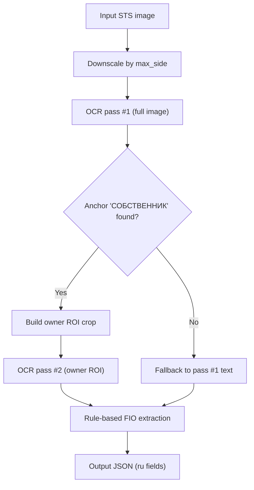
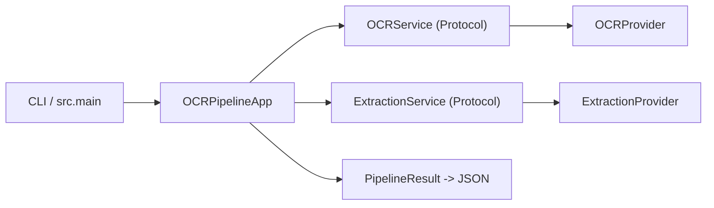

# Архитектура решения и план развития

## Основное 

### 1) Алгоритм

Решение использует двухстадийный OCR: сначала полный кадр для поиска якоря `СОБСТВЕННИК`, затем повторный OCR на целевом crop блока владельца. Перед OCR изображение при необходимости уменьшается по `max_side`, если разрешение слишком большое, чтобы стабилизировать качество распознавания и ограничить вычислительные затраты. После OCR применяется rule-based extraction, где текст нормализуется и из него выделяются `фамилия`, `имя`, `отчество` на русском.

**Стек и OCR-компоненты:**
- Python 3.11, `numpy`, `pillow`, `paddleocr`, `paddlepaddle`.
- Модели PaddleOCR в текущем стеке: `PP-OCRv5_server_det` (детекция текста), `eslav_PP-OCRv5_mobile_rec` (распознавание текста), `PP-LCNet_x1_0_doc_ori` (ориентация документа), `UVDoc` (document unwarping), `PP-LCNet_x1_0_textline_ori` (ориентация текстовых линий).
- 1-й проход (`predict` на full image) выполняется с отключенными `doc_ori/unwarping/textline_ori`, чтобы получить anchor и боксы текста через det+rec; 2-й проход (`predict` на ROI) использует стандартный OCR-конвейер на локальной области для более чистого распознавания блока владельца.
- Извлечение сущностей: rule-based `ExtractionProvider` (Слова из более, чем трех букв, написанные кириллицей).

### 2) Архитектура обертки над алгоритмом

Код разделен на три слоя: оркестрация (`src/main.py`), контракты/DTO (`src/core`) и реализации (`src/providers`). Такое разделение делает pipeline прозрачным и позволяет менять реализацию OCR/extraction без переписывания точки входа. Локальный инференс выбран для автономности, воспроизводимости и отсутствия внешних API-зависимостей.

### 3) Ops (контейнеризация, CI, зависимости)

Приложение контейнеризировано (`Dockerfile`, `docker-compose.yaml`), а кэши Paddle вынесены в volume, чтобы не загружать модели заново при повторных запусках. Текущий инференс реализован на CPU для быстрой сборки. CI в GitHub Actions проверяет линт/формат и запускает CI-safe тест без тяжелого OCR-инференса. В `pyproject.toml` зависимости разделены на группы (`test`, `ocr`, `research`), поэтому можно гибко собирать окружение под задачу.

### 4) Улучшение качества распознавания

- Предобработка изображения: deskew, denoise, doc-crop, chunking, CLAHE/контраст и более адаптивный выбор ROI по anchor-кандидатам. 
- OCR + LLM enrichment для пост-валидации и исправления OCR-ошибок в тексте. 
- Полный VLM-проход, где ФИО извлекается напрямую из изображения по промпту (Такое решение из коробки даст лучшие результаты, но оно хорошо для универсальных задач, у нас же более таргетная задача и текущий подход с разделением ответственностей дает больше контроля над пайплайном обработки и в перспективе соотвественно может быть лучше VLM).
- Fine-tuning моделей распознавания текста. 
- Для устойчивого улучшения качества нужно собирать датасет из открытых источников/интернета, анализировать проблемные кейсы (блики, шум, нестандартный layout, низкое качество фото), делать аугментации на их основе и адресно закрывать их через таргетные доработки и дообучение.

## Дополнительно: как вырастить решение до production

Поверх текущего ядра логично добавить FastAPI API Gateway с асинхронной обработкой через очередь задач и пул воркеров для масштабирования. В прод-контуре важно отдельно мониторить результаты с низким confidence и аномальные строки (например, отчество вида `Ралбксбевирай` содержит неестественные последовательности согласных), складывать такие примеры в feedback-датасет и регулярно дообучать/донастраивать пайплайн. Замена бэкенда инференса (ONNX Runtime, TensorRT), переход на GPU с бенчмарками по latency/cost/quality и валидацией качества относительно текущего решения. При замене моделей/логики нужны версионирование артефактов и безопасные стратегии миграции (shadow/canary), чтобы сравнивать новое и текущее решение до полного переключения.
